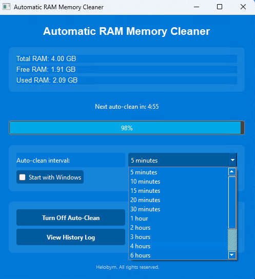
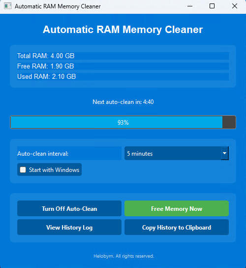

This software is developed by [Helobym](https://helobym.com)

The Automatic RAM Cleaner is a Windows-based utility designed to optimize system performance by managing and cleaning RAM memory.

[Demo Video](https://youtu.be/W78JEJZ4QQk)

